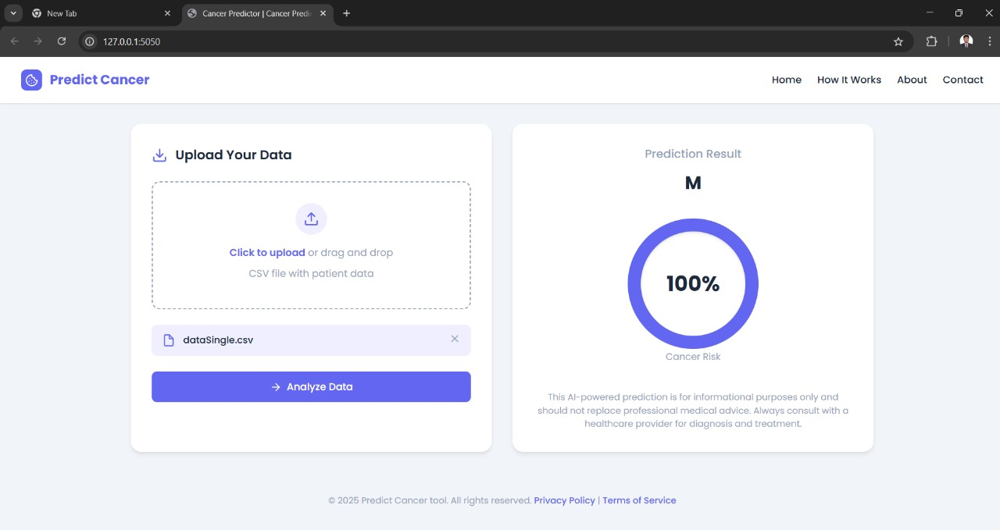

# 🔬 Cancer Detection System using H2O AutoML

This project showcases a machine learning-based cancer detection system powered by **H2O AutoML**, paired with a lightweight web interface for real-time prediction. The model, trained on the **Wisconsin Diagnostic Breast Cancer (WDBC)** dataset, takes **CSV file input** to predict whether a tumor is **benign** or **malignant**. It demonstrates high accuracy and ease of use, making it suitable for medical data analysis and research applications.

---

## 🚀 Project Overview

Breast cancer remains a leading cause of mortality worldwide, and early diagnosis is crucial. This project automates the machine learning workflow using **H2O AutoML**, including preprocessing, model training, selection, evaluation, and explainability. The trained model is integrated into a web app where users can upload diagnostic **CSV files** and instantly receive predictions.

We tested the system with:
- ✅ One benign case — correctly classified
- ❌ One malignant case — also correctly identified

This illustrates the system’s reliability in real-world, single-patient scenarios.

---

## ✅ Model Performance (H2O AutoML)

| Metric         | Value     |
|----------------|-----------|
| 🎯 Accuracy     | 99.13%    |
| 📈 R² Score     | 0.9547    |
| 📉 MSE          | 0.0104    |
| 📉 RMSE         | 0.102     |
| 🔐 Log Loss     | 0.0435    |
| 📊 AUC          | 0.9991    |
| 📊 AUCPR        | 0.9985    |

These results demonstrate strong predictive performance and minimal error rates, even on unseen individual patient records.

---

## 🧠 Technologies Used

- **Python**, **Pandas**, **NumPy**
- **H2O AutoML**
- **Google Colab** for training and evaluation
- **Matplotlib**, **Seaborn** for visual analysis
- **HTML/CSS/JavaScript** for frontend interface

---

## 🖼️ Web App Screenshots

The screenshots below demonstrate the CSV upload functionality and prediction output using two test cases:

### 📊 Prediction Result – Malignant Case
<!-- Replace with screenshot showing malignant prediction -->

### 📈 Prediction Result – Benign Case
<!-- Replace with screenshot showing benign prediction -->

> 📁 All images should be placed in the `/assets` directory of the repository.

---

## 🔮 Future Scope

Planned enhancements include:

- 📊 Batch prediction summary visualization
- 🔐 Doctor login and patient history tracking
- ☁️ Hosting with Flask backend and Docker
- 🧠 Extension to other types of cancer datasets or image inputs

---

## 🙋‍♂️ Contributors

- **Abhinaba Mukherjee**  
- **Sudeep Kumar**  
- **Guide**: Prof. Nasim Anjum Hoque (CSD, Dr. B. C. Roy Engineering College)

---

⭐ If you found this project interesting, please consider giving it a star!
