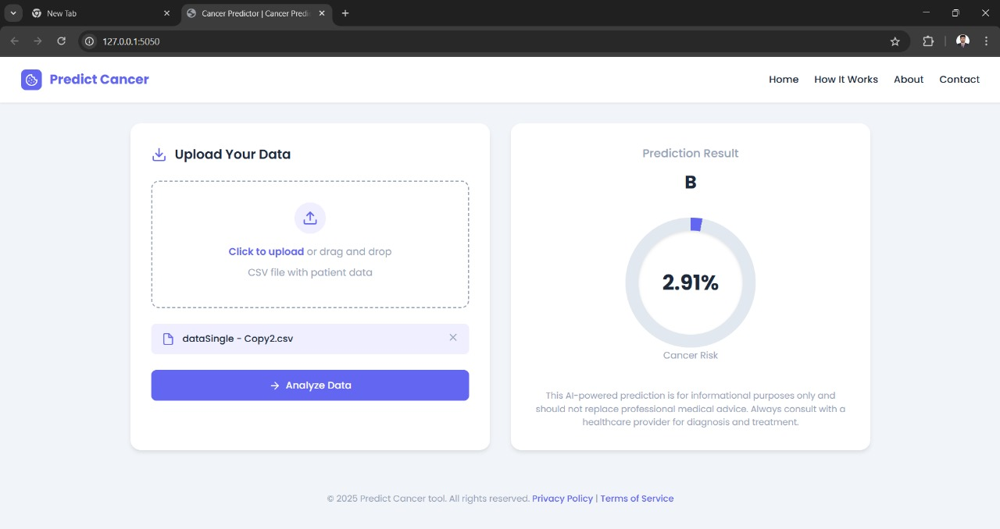

# 🔬 Cancer Detection System using H2O AutoML

This project demonstrates an end-to-end cancer prediction system powered by **H2O AutoML**, combined with an intuitive web interface for user interaction. The goal is to assist early breast cancer detection using individual diagnostic inputs. We tested the model on two real cases — one benign and one malignant — to showcase its classification accuracy and usability.

---

## 🚀 Project Overview

Breast cancer is a critical public health issue that benefits greatly from early and accurate diagnosis. This system automates the machine learning pipeline using **H2O AutoML**, trained on the **Wisconsin Diagnostic Breast Cancer (WDBC)** dataset. It allows users to interact with the trained model through a user-friendly **web application** that supports:

- 🧪 Manual input of tumor features  
- 📂 CSV file uploads (future plan)  
- 📊 Instant prediction of benign or malignant status

To demonstrate the system’s effectiveness, we tested the application on:
- ✅ A benign case — correctly classified
- ❌ A malignant case — also correctly identified

---

## ✅ Model Performance (H2O AutoML)

| Metric         | Value     |
|----------------|-----------|
| 🎯 Accuracy     | 99.13%    |
| 📈 R² Score     | 0.9547    |
| 📉 MSE          | 0.0104    |
| 📉 RMSE         | 0.102     |
| 🔐 Log Loss     | 0.0435    |
| 📊 AUC          | 0.9991    |
| 📊 AUCPR        | 0.9985    |

These results indicate that the model is well-calibrated, robust, and capable of making highly confident predictions even on individual patient data.

---

## 🧠 Technologies Used

- **Python**, **Pandas**, **NumPy**
- **H2O AutoML**
- **Google Colab** for training
- **Matplotlib**, **Seaborn** for evaluation
- **Flask (Planned)** for web integration
- **HTML/CSS/JavaScript** for the interface

---

## 🖼️ Web App Screenshots

The following screenshots demonstrate the user interface and functionality of the cancer detection web app tested with two sample patients:

### 📊 Prediction Result – Malignant Case
<!-- Replace with your malignant result screenshot -->

### 📈 Prediction Result – Benign Case
<!-- Replace with your benign result screenshot -->

> 📝 Screenshots are stored in the `/assets` folder.

---

## 🔮 Future Scope

Planned improvements include:

- 📂 Support for bulk prediction via CSV upload  
- 📊 Visualization of risk scores and confidence metrics  
- 🔐 Secure user authentication for medical professionals  
- ☁️ Cloud deployment (e.g., Heroku, Render)  
- 🧠 Expansion to multi-class tumor classification and image input

---

## 🙋‍♂️ Contributors

- **Abhinaba Mukherjee**  
- **Sudeep Kumar**  
- **Guide**: Prof. Nasim Anjum Hoque (CSD, Dr. B. C. Roy Engineering College)

---

⭐ If you like this project, consider giving it a star and sharing with your network!
